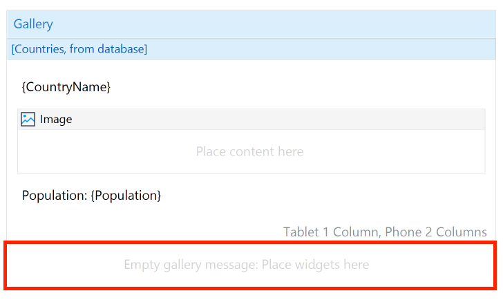
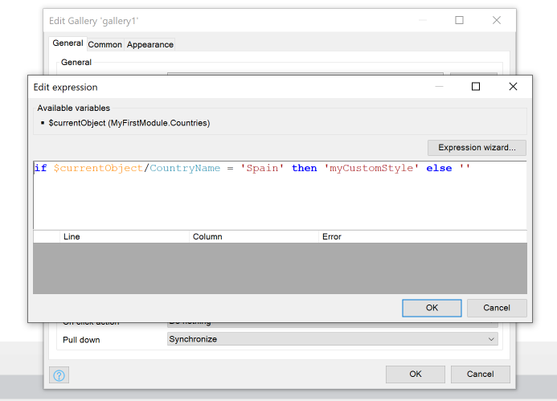
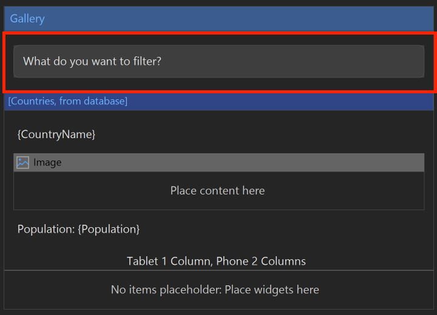

## Gallery

### 1 Introduction

The Gallery widget, a replacement for both the template grid and list view, helps you build beautiful lists and grids for tablet, and mobile devices. The Gallery widget provides options for varying columns per device type and gives you the power to create amazing grid and list experiences for every user.

### 1.2 Features

-   Pagination.
-   Empty list option.
-   Pull down event.
-   It can handle on Click events on each item.

## 2 Configuration

Several options can be defined in the Gallery widget:

### 2.1 Data Source

Data source specifies the source of the data being presented in the Gallery. You can select data from **Database**, **Nanoflow**, or **Xpath**.

### 2.2 Columns

We provide a mechanism that automatically applies a different number of columns based on the device being used. In the gallery widget you can select columns for **Tablets**, or **Phone/Mobile**.

### 2.3 Items

In the items group you can define the properties related to the items being presented.

### 2.3.1 Page size

Defines the amount of data shown for each page or the limit to be presented.

### 2.3.2 Pagination

You can choose between `Load more button` (button being presented below) or `Virtual scrolling` (mechanism that automatically loads data when the users reaches the bottom of the scrollbar).

### 2.3.3 Empty Message

Here you can place widgets that will be presented when no items are available to be shown:

### 2.3.4 Dynamic Item Class

In the new Gallery widget we offer an option to dynamically apply a style object to a specific item. You can achieve this by adding an expression based on the item values (attributes) like the example below.

In this example we check the value of `CountryName`, then if the attribute is equal to `Spain` apply the style object `myCustomStyle` to the items:

## 2.4 Events

The new Gallery widget can trigger some events while iterating with it.

### 2.4.1 On Click Action

Triggers an action (such as a nanoflow, Show page, etc. action) when the end-user clicks in one of the items.

### 2.4.2 On Pull Down Action

Triggers an action (such as a nanoflow, Synchronize, etc. action) when the end-user swipe down of the list.

### Filtering

In order to enable filtering within the gallery items you need to select the desired attributes to be filtered in the Filtering tab.

The attributes selected here will be used for the matching filter placed inside the composable region. When using multiple attributes, the filters will automatically select the matching attributes and then compose the desired filter value in an OR expression. Make sure you just have one filter widget for each type, for example Text Filter.

> ⚠️ **If a filter is being used and its type does not match with any selected attribute it will throw an error requesting you to select the correct filter widget.**

An example of filtering configuration:

An example of text filter:

## Custom styling

The look and feel of the widget is fully customizable. Check out the <a href="https://docs.mendix.com/refguide/mobile/designing-mobile-user-interfaces/widget-styling-guide/#1132-gallery">Native Mobile Styling documentation</a> for a full overview of the available style customizations.
